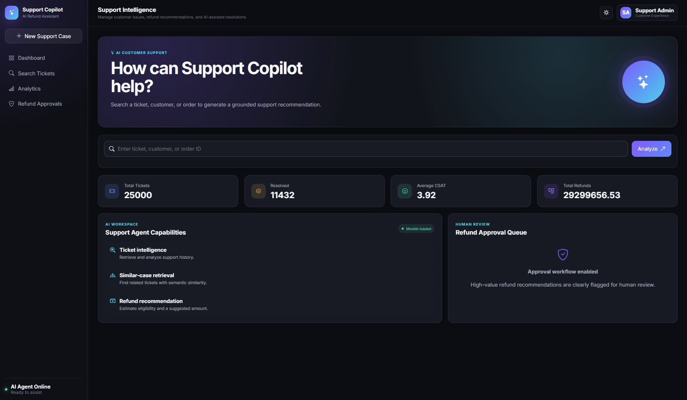

<div align="center">

# 🤖 Support Copilot

### AI-Powered Customer Support & Refund Recommendation System

An intelligent customer support platform built using **Flask**, **LangChain**, **Machine Learning**, and **Retrieval-Augmented Generation (RAG)**.

<p align="center">


</p>

</div>

---

# 🎥 Demo

> Click the image below to watch the demo video.

<p align="center">

<a href="demo.gif">



</a>

</p>

---

# 📊 Dashboard

<p align="center">


</p>

The dashboard provides

- AI-powered ticket search
- Business KPIs
- Customer support analytics
- Refund approval queue
- Modern ChatGPT/Copilot-inspired interface

---

# 🔍 Smart Ticket Search

<p align="center">


</p>

Search tickets using

- Ticket ID
- Customer ID
- Order ID

The system retrieves ticket information and opens the AI support workspace.

---

# 🤖 AI Support Workspace

<p align="center">


</p>

The AI workspace provides

- Customer information
- Ticket details
- AI-generated response
- Refund recommendation
- Similar historical tickets
- Human approval workflow
- Interactive AI chat

---

# ✨ Features

- 🤖 AI Customer Support Copilot
- 💰 Refund Recommendation Engine
- 📚 Similar Ticket Retrieval using RAG
- 🧠 Machine Learning Refund Prediction
- 👨‍💼 Human Approval Workflow
- 📊 Analytics Dashboard
- 🔍 Ticket Search
- 💬 ChatGPT-style Interface
- 🌙 Premium Dark Theme
- ⚡ Responsive Bootstrap UI

---

# 🏗️ System Architecture

```text
                    Customer

                        │

                        ▼

                Flask Web Application

                        │

                        ▼

              LangChain AI Support Agent

          ┌─────────────┴─────────────┐

          ▼                           ▼

   Ticket Retrieval            Similar Ticket Search

          │                           │

          └─────────────┬─────────────┘

                        ▼

               Refund Prediction Model

                        ▼

               AI Recommendation Engine

                        ▼

             Human Approval (if required)

                        ▼

              Final Customer Response
```

---

# 🔄 Workflow

```text
Search Ticket

      │

      ▼

Retrieve Ticket

      │

      ▼

Retrieve Similar Historical Cases

      │

      ▼

Predict Refund Eligibility

      │

      ▼

Generate AI Response

      │

      ▼

Human Approval (if required)

      │

      ▼

Customer Response
```

---

# 🛠️ Technology Stack

| Component | Technology |
|------------|------------|
| Backend | Flask |
| AI Framework | LangChain |
| Agent Framework | LangGraph |
| Vector Database | FAISS |
| Embeddings | Sentence Transformers |
| Machine Learning | Scikit-Learn |
| UI | Bootstrap 5 |
| LLM | Ollama / OpenAI |
| Language | Python |

---

# 📂 Project Structure

```text
SupportCopilot/

│

├── app.py

├── config.py

├── data_service.py

├── model_service.py

├── agent_service.py

│

├── dataset/

│

├── models/

│

├── notebooks/

│

├── templates/

│

├── static/

│

├── requirements.txt

│

└── README.md
```

---

# ⚙️ Installation

```bash
git clone https://github.com/yourusername/SupportCopilot.git

cd SupportCopilot

pip install -r requirements.txt

python app.py
```

Open

```
http://127.0.0.1:5000
```

---

# 📸 Screenshots

| Dashboard | AI Workspace |
|-----------|--------------|
|  |  |

---

# 🚀 Future Improvements

- Voice-enabled Support Agent
- WhatsApp Integration
- Email Automation
- CRM Integration
- Multi-Agent Architecture
- Docker Deployment
- Kubernetes Deployment
- Cloud Deployment (Azure / AWS)
- LangGraph Memory
- Authentication & Role Management

---

# 🤝 Contributing

Contributions are welcome.

If you'd like to improve this project, feel free to fork the repository and submit a pull request.

---

# 📄 License

This project is licensed under the MIT License.

---

<div align="center">

### ⭐ If you found this project useful, please consider giving it a Star ⭐

</div>
